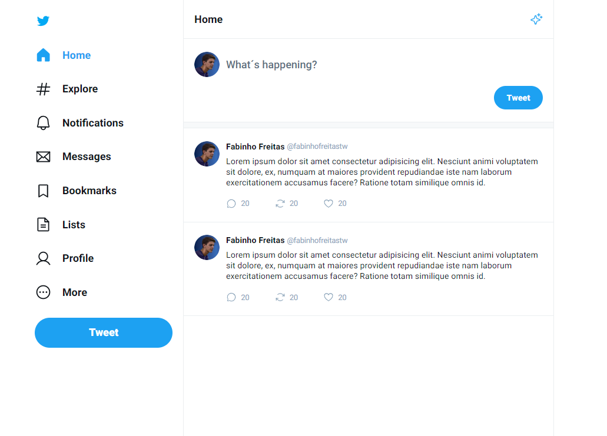
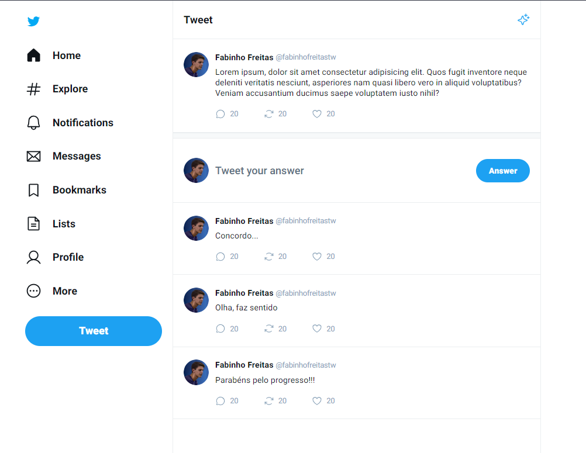
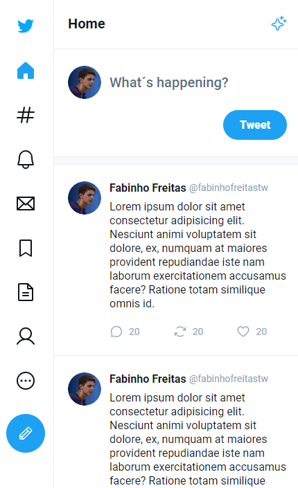

# CLONE TWITTER
A clone of the social network Twitter, using React and Vite concepts for initial learning.

## 💻 IMAGE ONE


## 💻 IMAGE TWO


## 💻 IMAGE THREE


## 🛠️ Technologies
- React
- Vite
- Typescript
- Git and Github

## 📞 Contact
- freitasfabiano08@gmail.com
- @fabinhofreitastw

## ⚙️ How To Install?
- Clone the repository
- Run the command: ```npm install```
- Run the command: ```npm run dev```
- Enjoy!!!
